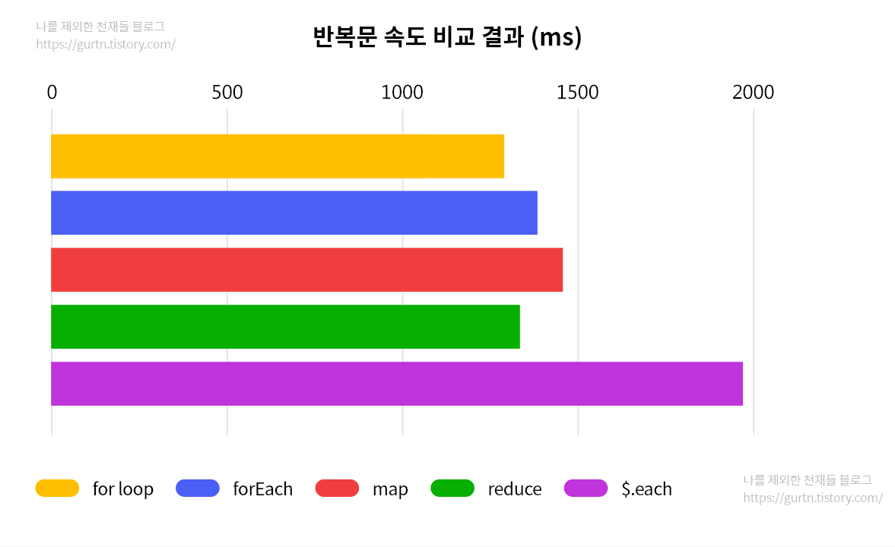

# 반복문 속도 관련

---

## for

```javascript
const array = new Array(10000000).fill().map((v, i) => i);

const start = new Date();

let str = "";

for (let i = 0; i < array.length; i++) {
  str += array[i];
}

console.log(new Date() - start);

//  결과 - 1291.1
```

## forEach

```javascript
const array = new Array(10000000).fill().map((v, i) => i);

const start = new Date();

let str = "";

array.forEach((v) => {
  str += v;
});

console.log(new Date() - start);

// 결과 - 1385.8
```

## map

```javascript
const array = new Array(10000000).fill().map((v, i) => i);

const start = new Date();

let str = "";

array.map((v) => {
  str += v;
});

console.log(new Date() - start);
// 결과 - 1458.2
```

## reduce

```javascript
const array = new Array(10000000).fill().map((v, i) => i);

const start = new Date();

let str = "";

array.reduce((acc, v) => {
  str += v;
});

console.log(new Date() - start);
// 결과 - 1335.9
```

## $.each

```javascript
const array = new Array(10000000).fill().map((v, i) => i);

const start = new Date();

let str = "";

$.each(array, (i, v) => {
  str += v;
});

console.log(new Date() - start);
// 결과 - 1971.3
```

---

## 속도 결과



출처: https://gurtn.tistory.com/121
